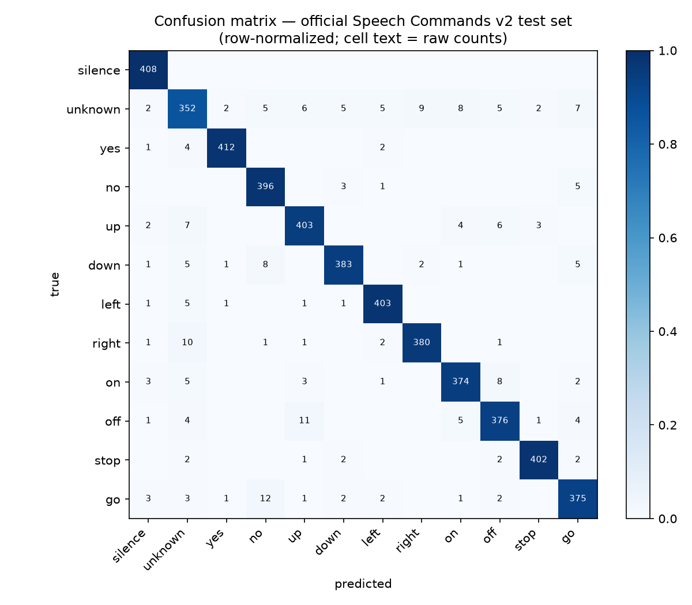

# tiny-kws — edge keyword spotting

A ~119K-parameter (~0.48 MB) depthwise-separable CNN that recognizes 10
spoken commands — *yes, no, up, down, left, right, on, off, stop, go* —
plus *unknown* and *silence*, from 1-second audio clips. Trained in PyTorch
on Google Speech Commands v2 and deployed as a live browser-microphone demo
on Hugging Face Spaces (free CPU).

**Live demo:** https://huggingface.co/spaces/priyadeepjaiswal9c/tiny-kws · **Model:** https://huggingface.co/priyadeepjaiswal9c/tiny-kws



## Results

All numbers are produced by [`src/evaluate.py`](src/evaluate.py) on the
**official Speech Commands v2 test set** (4,890 clips, speaker-disjoint
from training) and stored in [`assets/metrics.json`](assets/metrics.json).

| metric | value |
|---|---|
| test accuracy | **95.38%** |
| macro-F1 | **95.35%** |
| parameters | 119,372 |
| weights (fp32) | 0.51 MB |
| CPU latency (batch=1, 1 thread, Apple M2) | 1.86 ms mean / 1.96 ms p95 |

*Current numbers are from a 3-epoch smoke-test checkpoint trained on Apple
M2 (MPS); the full 30-epoch Colab T4 run will replace them. Weakest class:
"unknown" (F1 0.874); most confused pairs: go→no (12), off→up (11).*

Published reference points on this benchmark (not our numbers): the original
CNN baseline reaches 88.2% (Warden 2018); Keyword Transformer reports 98.6%
(Berg et al. 2021). The Attention-RNN line of work reports 93.9% on the
related 35-class task (de Andrade et al. 2018).

## How it works

```
1 s waveform (16 kHz) ──STFT 25ms/10ms──► power spectrogram
  ──64 mel filters, log──► log-mel "image" (64×101)
  ──DS-CNN (stem + 4 depthwise-separable blocks + GAP)──► 12 logits
```

- **12-class benchmark setup**: 10 keywords; "unknown" = a seeded 10% sample
  of the other 25 words; "silence" = random crops of `_background_noise_`.
  Official `validation_list.txt`/`testing_list.txt` splits (speaker-disjoint).
  Exact per-class counts: `data/processed/manifest.json` after data prep.
- **Augmentation** (train only): random ±100 ms time-shift + background-noise
  mixing (p=0.8, volume U(0, 0.1)).
- **Training**: AdamW, lr 3e-3 cosine-annealed, batch 128, label smoothing
  0.1, 30 epochs on a free Colab T4 (fp32).

See [LEARNING.md](LEARNING.md) for plain-English explanations of every
concept (sampling/Nyquist → mel filterbanks → depthwise-separable convs →
metrics), written to be readable by a 2nd-year engineering student.

## Reproduce

```bash
python3 -m venv .venv && source .venv/bin/activate
pip install -r requirements.txt

# 1. data: download + extract Speech Commands v2 (~2.4 GB) and the official test set
mkdir -p data/SpeechCommands/speech_commands_v0.02 data/test_set
curl -L -o data/sc.tar.gz  https://storage.googleapis.com/download.tensorflow.org/data/speech_commands_v0.02.tar.gz
curl -L -o data/sct.tar.gz https://storage.googleapis.com/download.tensorflow.org/data/speech_commands_test_set_v0.02.tar.gz
tar -xzf data/sc.tar.gz  -C data/SpeechCommands/speech_commands_v0.02
tar -xzf data/sct.tar.gz -C data/test_set && rm data/*.tar.gz

# 2. build 12-class splits + feature caches (writes data/processed/)
python src/prepare_data.py

# 3. train (auto-selects CUDA > Apple MPS > CPU)
python src/train.py --epochs 30

# 4. evaluate on the official test set -> assets/metrics.json + confusion matrix
python src/evaluate.py

# 5. run the demo locally
python app/app.py
```

Or run the whole training on a free Colab T4:
[`notebooks/train_colab.ipynb`](notebooks/train_colab.ipynb).

## Repository layout

```
src/
  common.py        labels, feature params, LogMel frontend (single source of truth)
  prepare_data.py  official splits -> waveform bank + log-mel caches + manifest
  dataset.py       train (waveform + augmentation) / eval (cached features) datasets
  model.py         DS-CNN (119K params)
  train.py         training loop (CUDA/MPS/CPU), checkpoints with embedded config
  evaluate.py      official-test-set metrics, confusion matrix, CPU latency
app/app.py         Gradio demo (mic -> 16 kHz mono -> best 1 s window -> model)
notebooks/train_colab.ipynb
LEARNING.md        concept-by-concept explanation (interview prep)
```

## Citations

- P. Warden, *Speech Commands: A Dataset for Limited-Vocabulary Speech
  Recognition*, 2018. arXiv:1804.03209. Dataset CC-BY-4.0.
- Y. Zhang, N. Suda, L. Lai, V. Chandra, *Hello Edge: Keyword Spotting on
  Microcontrollers*, 2017. arXiv:1711.07128 (DS-CNN architecture).
- D. C. de Andrade et al., *A neural attention model for speech command
  recognition*, 2018. arXiv:1808.08929.
- A. Berg, M. O'Connor, M. T. Cruz, *Keyword Transformer*, 2021.
  arXiv:2104.00769.

License: MIT (code). Dataset: CC-BY-4.0 (Google).
